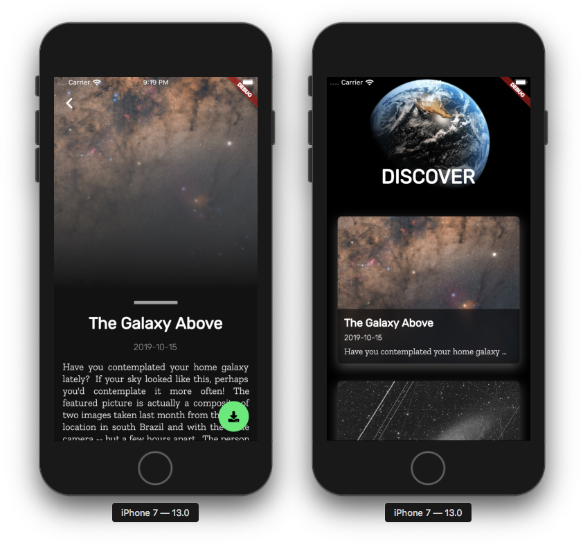

# NASA Astronomical Picture of the Day (APOD)

A simple [Flutter](https://flutter.dev/) Application that shows a list of Astronomical Pictures in chronological order fetched from [NASA APOD API](https://apod.nasa.gov/apod/astropix.html) 🚀🛰

## Screenshots


## Getting Started
Make sure you grab the **API_KEY** from [NASA API](https://api.nasa.gov/).
<br>After you have obtained the api key.
Create a new file called `api_key.json` in `assets/` directory.
<br>
Copy & paste the following lines into it and make sure to **replace** the key with your **API_KEY**
```
{
    "key": "YOUR_API_KEY_HERE"
}
```
From here onwards its pretty straight forward. Just `cd` into the root directory and run `flutter run` to run the app on your emulator/device.


## Packages Used
- [dio](https://pub.dev/packages/dio)
- [provider](https://pub.dev/packages/provider)
- [built_value](https://pub.dev/packages/built_value)
- [intl](https://pub.dev/packages/intl)
- [cached_network_image](https://pub.dev/packages/cached_network_image)
- [photo_view](https://pub.dev/packages/photo_view)
- [image_downloader](https://pub.dev/packages/image_downloader)

<br>
This Flutter app should serve as a kickstarter to many new/intermediate Flutter Devs who are willing to contribute in #hacktoberfest 👩‍💻👨‍💻
<br>
<br>
This app isn't perfect. Let's add more features and improve this 😇
<br>
<br>

**Check out the issues section and send in the PR's** 💛

Happy Hacktoberfest!